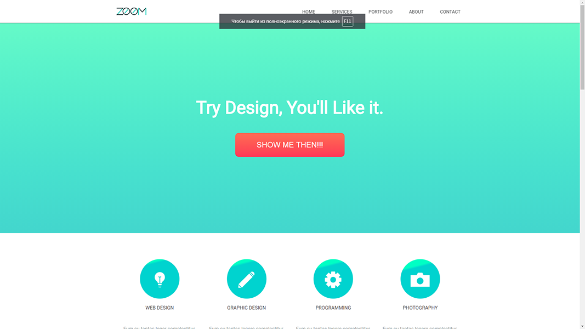

# <a id="top" />ZOOM

---

### Оглавление
  - [Описание](#description)
  - [Ссылки](#references)
  - [Автор](#autor)

---

## <a id="description" />Описание

Мой самый первый сайт/шаблон
  - Выполнена адаптивная верстка

Проект выложен на Vercel (см. раздел "Ссылки")

### Технологии

- HTML
- CSS

---

### <a id="references" />Ссылки

Посмотреть проект можно [&rsaquo; тут &lsaquo;](https://zum-zdyo-nikitoskravecs-projects.vercel.app/)

---

### <a id="autor" />Автор

Никита Кравец

  - [GitHub](https://github.com/LSD237)
  - [VK](https://vk.com/id6725831)

[Наверх](#top)